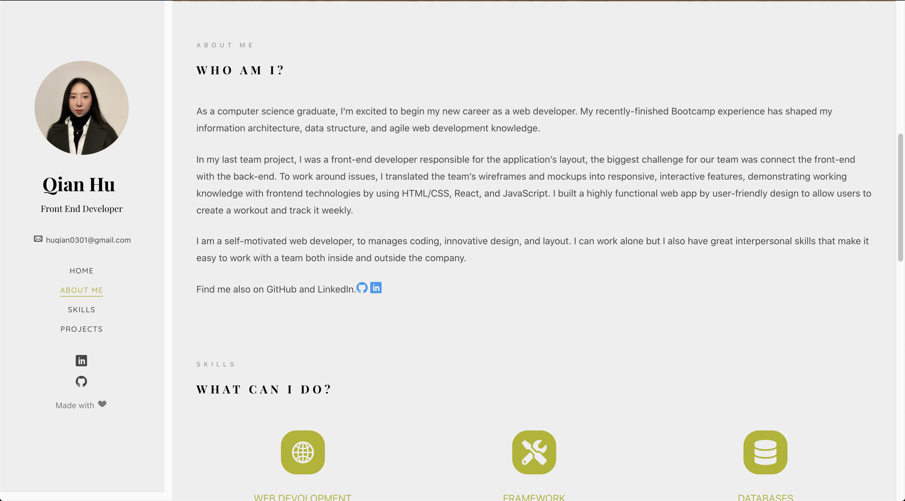
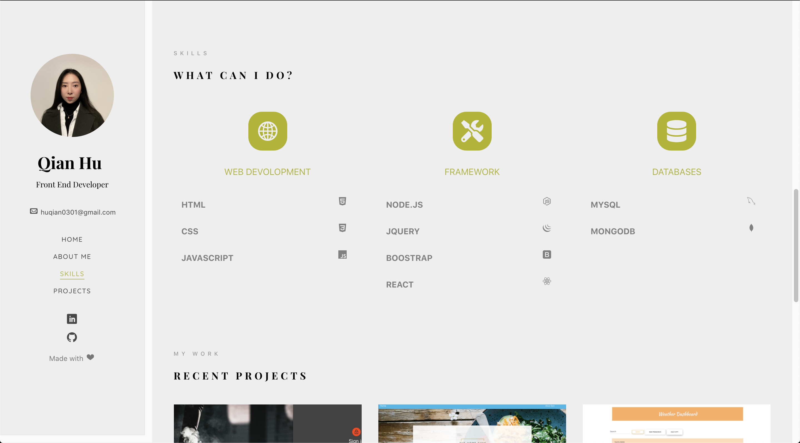
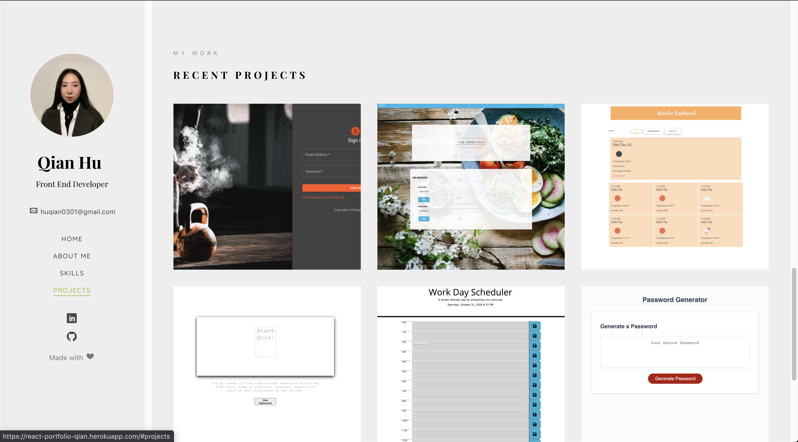

# Qian's Portfolio

## Table of Contents 

- [Qian's Portfolio](#qians-portfolio)
  - [Table of Contents](#table-of-contents)
  - [Project links](#project-links)
  - [Built With](#built-with)
  - [View](#view)
  

## Project links
<li>GitHub link: https://github.com/huqian301/react-portfolio </li>
<li>Heroku link: https://qianify.herokuapp.com/</li>

## Built With
+ [jQuery](https://jquery.com/) - <code>jQuery</code> is a JavaScript library designed to simplify HTML DOM tree traversal and manipulation, as well as event handling, CSS animation, and Ajax.
+ [Anime.js](https://animejs.com/) - <code>Anime.js</code> is a lightweight JavaScript animation library with a simple, yet powerful API.
It works with CSS properties, SVG, DOM attributes and JavaScript Objects.
+ [Bootstrap](https://getbootstrap.com/) - <code>Bootstrap</code> is a free and open-source CSS framework directed at responsive, mobile-first front-end web development.
+ [Font Awesome](https://fontawesome.com/) - <code>Font Awesome</code> is a font and icon toolkit based on CSS and Less.
+ [Favicon](https://favicon.io/) - <code> Favicon</code> is a small icon or collection of icons associated with a website, web page, or web application. It’s displayed within the browser tabs and bookmarks bar. 
+ [Material UI](https://material-ui.com/) - A popular CSS framework for React applications that develops responsive and mobile-first websites.
## View 

 
 
 
 
