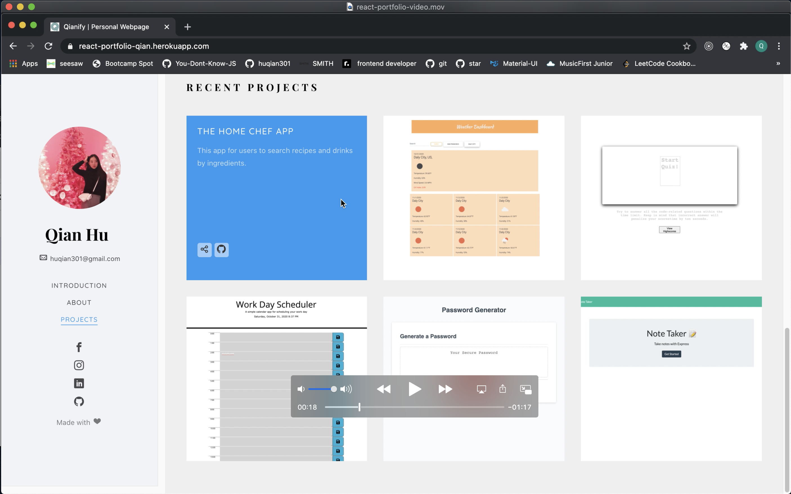
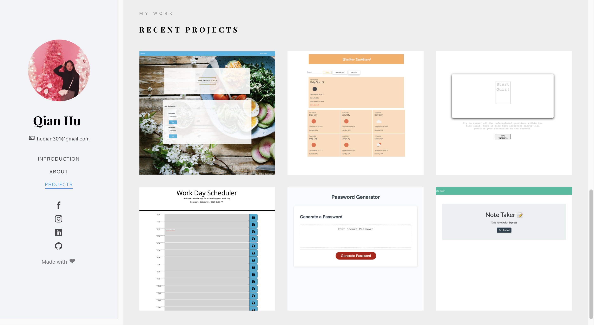

## Description
The main idea of thisproject is using React to build a personal portfolio page, and the whole page also build with HTML5, CSS3, Jquery, Bootstrap.
And I use Heroku to deployed my page.

## Project links
<li>GitHub link: https://github.com/huqian301/react-portfolio </li>
<li>Heroku link: https://react-portfolio-qian.herokuapp.com/</li>

## Output 
Here is the [Video](https://drive.google.com/drive/folders/1criQYlA7dzgzG4M9ekAER7u1-LnfUMuz?usp=sharing) that shows entire page. 

 

The final page will be look like as below image.

 
